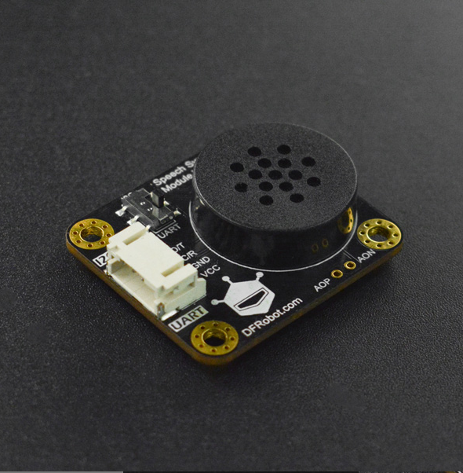

# DFRobot_SU03T
- [中文版](./README_CN.md)

The SU03-T offline voice module supports voice recognition and number synthesis.
This library is used for serial(and I2C) communication between Arduino and SU03-T.




## Product Link (https://www.dfrobot.com)
 SKU: DFR0987

## Table of Contents

* [Summary](#summary)
* [Installation](#installation)
* [Methods](#methods)
* [Compatibility](#compatibility)
* [History](#history)
* [Credits](#credits)

## Summary

   1. smartVoice <br>


## Installation

To use this library, first download the library file, paste it into the \Arduino\libraries directory, then open the examples folder and run the demo in the folder.

## Methods

```C++
  /**
   * @fn begin
   * @brief Init communication port
   * @return true or false
   */
  virtual bool begin(void);

  /**
   * @fn autoExitWakeup
   * @brief Set whether to automatically exit the wakeup state. By default, the
   * @n system automatically exits the wakeup state in 10 seconds.
   * @param mode - true : Automatically exits the wake up state;
   * @n            false : Do not exit the wake up state
   * @return None
   */
  void autoExitWakeup(bool mode);

  /**
   * @fn readEntryID
   * @brief Read the ID corresponding to the entry recognized by the voice recognition module
   * @return  ID
   */
  uint16_t readEntryID(void);
  
  /**
   * @fn sendInfo
   * @brief Send single data of char type
   * @param id correspond to the entry
   * @param data Parameters required for the answer to the question of corresponding entry
   * @return 0 for success
   */
  uint8_t sendInfo(uint8_t id,char data);

  /**
   * @fn sendInfo
   * @brief Send single data of int type
   * @param id correspond to the entry
   * @param data Parameters required for the answer to the question of corresponding entry
   * @return 0 for success
   */
  uint8_t sendInfo(uint8_t id,int data);

  /**
   * @fn sendInfo
   * @brief Send single data of double type
   * @param id correspond to the entry
   * @param data Parameters required for the answer to the question of corresponding entry
   * @return 0 for success
   */
  uint8_t sendInfo(uint8_t id,double data);

  /**
   * @fn sendInfo
   * @brief Send single data of unsigned char type
   * @param id correspond to the entry
   * @param data Parameters required for the answer to the question of corresponding entry
   * @return 0 for success
   */
  uint8_t sendInfo(uint8_t id,unsigned char data);

  /**
   * @fn send
   * @brief Send multiple data, which can be in different data types
   * @param id correspond to the entry
   * @param s The data types of different data
   * @n (...) represents changeable parameter, i.e. the answer requires multiple parameters.
   * @return 0 for success
   */
  uint8_t send(uint8_t id, char *s, ...);
```

## Compatibility

MCU                | Work Well    | Work Wrong   | Untested    | Remarks
------------------ | :----------: | :----------: | :---------: | -----
Arduino Uno        |      √       |              |             | 
Mega2560        |      √       |              |             | 
Leonardo        |      √       |              |             | 
ESP32        |      √       |              |             | 
ESP8266        |      √       |              |             | 
M0        |      √       |              |             | 


## History


- 2022/04/14 - Version 1.0.0 released.


## Credits

Written by fengli(li.feng@dfrobot.com), 2022. (Welcome to our [website](https://www.dfrobot.com/))
