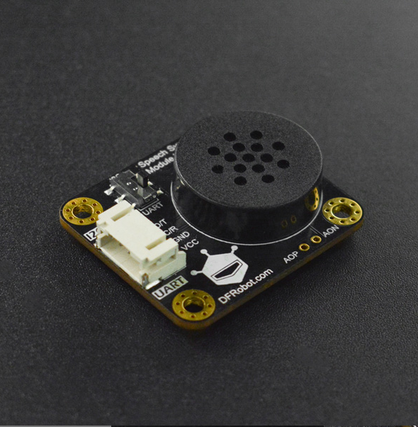

# DFRobot_SU03T
- [English Version](./README.md)

SU03-T是一款离线语音模组，支持语音识别和数字的合成。
本库用于arduino主控与SU03-T之间的串口以及I2C通讯。




## 产品链接 (https://www.dfrobot.com.cn)
 SKU: DFR0987

## Table of Contents

  * [概述](#概述)
  * [库安装](#库安装)
  * [方法](#方法)
  * [兼容性](#兼容性)
  * [历史](#历史)
  * [创作者](#创作者)

## Summary

   1. smartVoice <br>


## Installation

使用此库前，请首先下载库文件，将其粘贴到\Arduino\libraries目录中，然后打开examples文件夹并在该文件夹中运行演示。

## 方法

```C++
  /**
   * @fn begin
   * @brief Init communication port
   * @return true
   */
  virtual bool begin(void);

  /**
   * @fn autoExitWakeup
   * @brief 设置是否自动退出唤醒状态, 默认10秒后自动退出唤醒状态
   * @param mode - true : 自动退出唤醒状态; false : 不用退出唤醒状态
   * @return None
   */
  void autoExitWakeup(bool mode);

  /**
   * @fn readEntryID
   * @brief 读取语音识别模块识别到的词条对应的ID
   * @return  ID
   */
  uint16_t readEntryID(void);
  
  /**
   * @fn sendInfo
   * @brief 发送单个数据,char类型数据
   * @param id 对应词条
   * @param data 对应词条问题的回答所需要的参数
   * @return 0表示成功
   */
  uint8_t sendInfo(uint8_t id,char data);

  /**
   * @fn sendInfo
   * @brief 发送单个数据,int类型数据
   * @param id 对应词条
   * @param data 对应词条问题的回答所需要的参数
   * @return 0表示成功
   */
  uint8_t sendInfo(uint8_t id,int data);

  /**
   * @fn sendInfo
   * @brief 发送单个数据,double类型数据
   * @param id 对应词条
   * @param data 对应词条问题的答案所需要的参数
   * @return 0表示成功
   */
  uint8_t sendInfo(uint8_t id,double data);

  /**
   * @fn sendInfo
   * @brief 发送单个数据,unsigned char类型数据
   * @param id 对应词条
   * @param data 对应词条问题的回答所需要的参数
   * @return 0表示成功
   */
  uint8_t sendInfo(uint8_t id,unsigned char data);

  /**
   * @fn send
   * @brief 发送多个数据,可以是不同的数据类型
   * @param id 对应词条
   * @param s 不同数据代表所代表的数据类型
   * @n (...)表示可变参数,即答案需要多个参数
   * @return 0表示成功
   */
  uint8_t send(uint8_t id, char *s, ...);
```

## 兼容性

MCU                | Work Well    | Work Wrong   | Untested    | Remarks
------------------ | :----------: | :----------: | :---------: | -----
Arduino Uno        |      √       |              |             | 
Mega2560        |      √       |              |             | 
Leonardo        |      √       |              |             | 
ESP32        |      √       |              |             | 
ESP8266        |      √       |              |             | 
M0        |      √       |              |             | 


## 历史

- 2022/04/14 - 1.0.0 版本

## 创作者

Written by fengli(li.feng@dfrobot.com), 2022. (Welcome to our [website](https://www.dfrobot.com/))
